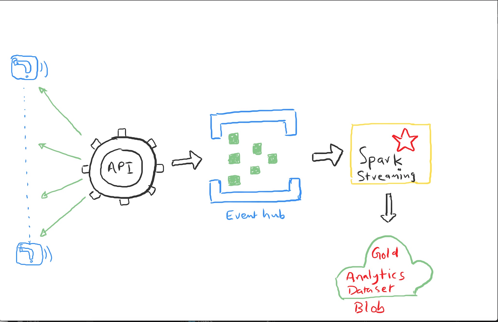
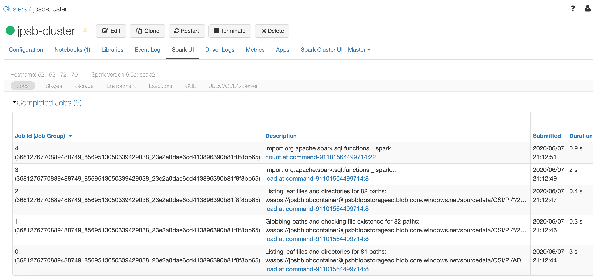
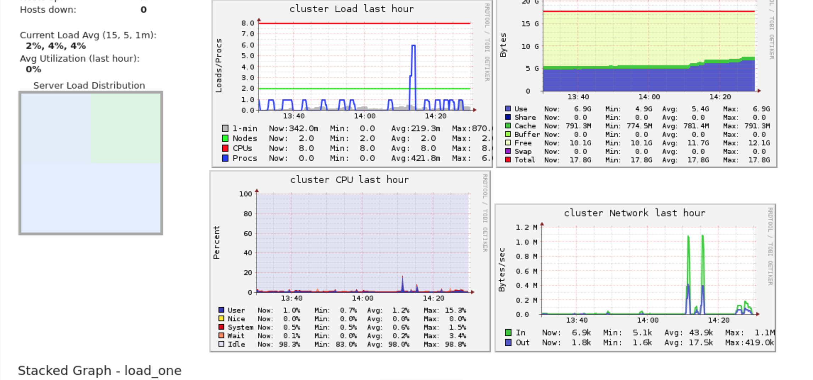

# Sensor Analytics 
This is a sample project to troubleshoot performance degradation on processing of high frequency sensor data.

## Scope
The current scope is limited to discuss possible solutions and not implementation.

## Requirement

An API application makes call every 15 minutes, it makes 40K calls, one for each tag, and then produces 40K Json files
 into Azure Storage. Databricks then needs to pick up this data and process it, the trouble being it is taking 40 minutes
  to read in the files. The requirement is to evaluate all possible options to minimise time taken for reading files.
  Refer to "Appendix A" section for details. 

## Problem areas
The issue needs to be narrowed down to one or more part of the ingestion data pipe line.
 
* Files metadata to read (list of object paths to read)

* Data load from azure (n/w, disk speed)

* Application processing (Spark Databricks)

## Assumptions
* There is a single api application pulling sensor dataset
* Due to unavailability of access on actual environment and further information on problem an assumption has been made
 "issue has already been narrowed down to reading files" as suggested in problem statement. 

## Observations
With the given information it seems like one or more of below could be potential cause for the issue.
* Azure storage partition structure 

* Large number of object paths (directories)

* Large number of small files

#### Azure Storage Partitions
* At the start Spark driver needs to find list of files to process and therefore makes calls to Azure blob storage to get
 metadata of list of files
 
* The object path to search contains wildcards /OSI/PI/\*/2020/04/16/\*_20200428_155139.json’

* This could potentially be an issue when hundreds of thousands of directory/files are qualified for scan within specified 
wildcard path, hence nested calls are made by Spark driver to azure storage to List the metadata for all these files.
  
* Azure will scan hundreds of thousands of object key paths under node 'OSI/PI/' which may take a long time, as they may have
 been accumulated over large period of time

#### Large number of directories (Object paths)

As part of processing Spark Driver uses files metadata, having a large number of directory is very inefficient. Typically 
Spark driver expects files from a small number of directories as opposed to thousands of directories.


#### Large number of small files

Spark default behaviour is to create one partition per file, therefore will create thousands of input partition each with
much smaller than default block size (128 MB) which is not very optimal. It also will increase meta data size repository 
resources overheads.

## Proposed Solutions

As no further information is available to isolate problem area, below solutions are proposed to be evaluated.

### Solution1 - Partition by API Pull 
Introduce a new partition stretagy for each pull as given below.
 
* Create a partition specific for every API pull (40K files data set).
* It could be a precondition for API application for API pull to create a partition based on datetime in a staging area 
* Partition format 'sourcedata/OSI/PI/STAGE/yyyy/MM/dd/yyyyMMdd_HHmmSS' i.e 'sourcedata/OSI/PI/STAGE/2020/04/16/20200428_155139' 
* All 40k files for the pull are persisted in the partition 

Pros      | Cons  
------------ | -------------
Faster read - as data locality under same same parent path       | Requires API application modification 
Faster files meta info retrieval - as no wildcard in files meta path | None 
Further improvements allows compaction - helps alleviate large number of small files problem  | None 
   
### Solution2 - Refactor Partition
Modify the partition order between swap Tags with datetime yyyy/MM/dd as shown below. 

```From /sourcedata/OSI/PI/ADISJFNISAF_SRES_SVR002FLW_D/2020/04/16/20200428_155139 to /sourcedata/OSI/PI/2020/04/16/ADISJFNISAF_SRES_SVR002FLW_D/20200428_155139``` 

Pros      | Cons  
------------ | -------------
Tags for the day to be scanned as opposed to entire tags       | Requires API application modification 
None    |  Unable to perform compaction as small files are not under same parent path 


### Solution3 - Improve Databricks Spark Application

Try below to evaluate any performance improvements.

#### Compact partitions 

Spark will create very large number of small partitions that is not efficient, hence use coalesce partitions to lower. 

Add below code refer to apache spark documentation for details.
 
>> df.coalesce(100)

#### Input partitions - size based 

Use number of input partitions based on the max data size of 16 MB, tune the size to higher/lower based on outcome. 
Add below configuartion in spark application
 > spark.conf("spark.sql.files.maxPartitionBytes", 16777216)

### Solution4 - Streaming Architecture
Introduce streaming architecture as shown below will resolve the issue.




Pros      | Cons 
------------ | -------------
Dataset processed in real time       | Implementation using new Arch and design 
None    |  Complexity of streaming application management 


### Diagnostic Toolset 

#### Spark Web UI
Spark Web UI is extremely useful to isolate issue as shown below

 


The job id with timestamp are a good indicator of isolating problem area as per below table

Job Id       | Description  
------------ | -------------
   0,1,2     |  Files metadata identification 
   3         |  Data load from azure
   4         |  Spark processing


#### Metrics

The cluster metrics are useful to identify any resource bottlenecks




### Misc - Performance Tuning tips

Try below one or more of below to evaluate any performance improvements:

#### Compact Large Number of small files
Large number of small problem are highly undesirable in big data processing due to number of reason, metadata resources
smaller partitions on processing etc. Hence fix them by using coalesce with overwrite or copy and overwrite. 

> >> df.coalesce(smaller number of partitions) 

#### Number of Shuffle partitions
Number of shuffle partitions have been hard coded inside spark to 200, you may need to use higher/lower based on your use case

Typical optimal shuffle size for each partition 100 MB, use below equation to calculate. 

```Num of shuffle partitions = Input exchange data size/100 MB```

> spark.conf("spark.sql.shuffle.partitions", "Number of shuffle partitions") 

#### Joins
Enforce broadcast joins to join large table with medium table (size up to 100 MB)
 
> broadcast(dataframe)

#### Lazy Loading
Lazy loading introduce filter early to load only dataset needed to avoid unnecessary load and processing

#### Stage Barrier
Introduce stage barrier where necessary to avoid recomputation of entire DAG stage

> df.localCheckpoint(...) or df.cache()

#### Vectorised SQL functions
Prefer spark sql vectorized functions in place of UDFs - Catalyst memory optiomisation present for spark sql vectorized functions
where as UDFs would use JVM based memory management


### Appendix A

Files are stored in the storage in a per the below

https://<storageaccount>.blob.core.windows.net/sourcedata/OSI/PI/ADDIT1ZB_SRES_SVR002FLW_C/2020/04/16/ADDIT1ZB_SRES_SVR002FLW_C_20200428_155139.json
https://<storageaccount>.blob.core.windows.net/sourcedata/OSI/PI/ADISJFNISAF_SRES_SVR002FLW_D/2020/04/16/ADISJFNISAF_SRES_SVR002FLW_D_20200428_155139.json

sourcedata/OSI/PI/<tag name>/<Schedule date (yyyy/MM/dd)>/<tag name><actual datetime>.json

Currently databricks does a wildcard search to find the files and read them in (has sourcedata mounted). i.e.
‘OSI/PI/\*/2020/04/16/\*_20200428_155139.json’

As there could be other tags from other pulls in the same container, but the actual datetime on the files will be the same for the 40K

Attached is an example of the Json, the data which is used is the timestamp value pairs ("Timestamp":"2020-04-26T16:00:00Z","Value":-0.009247541”)


 